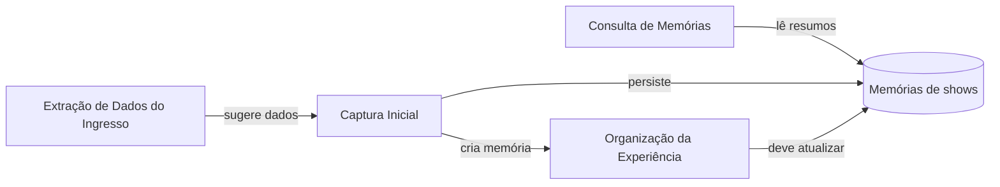

# Análise do Domínio — concerts-recap

## Objetivo e escopo

Este documento identifica o domínio de negócio do **concerts-recap** a partir das jornadas de usuário, da linguagem presente na interface e do comportamento implementado em `src/`.

Ele descreve o estado atual da aplicação. As classificações de domínio devem ser validadas com pessoas responsáveis pelo produto antes de orientarem decisões estratégicas.

## Domínio principal

O domínio do produto é **memórias de experiências em shows**.

O usuário registra um show ao qual assistiu e transforma os dados do evento em uma recordação pessoal: detalhes da apresentação, impressões, avaliações e momentos marcantes. O catálogo de shows existe para recuperar essas recordações posteriormente.

### Linguagem ubíqua observada

| Termo                  | Significado no produto                                          |
| ---------------------- | --------------------------------------------------------------- |
| Memória de show        | Registro de uma experiência em uma apresentação ao vivo.        |
| Show                   | Evento identificado por data, artista, local e cidade.          |
| Ingresso               | Imagem opcional usada como evidência e fonte de dados iniciais. |
| Captura inicial        | Registro dos dados mínimos para criar uma memória.              |
| Organização da memória | Enriquecimento da recordação com detalhes, tags e avaliações.   |
| Resumo de show         | Visão reduzida de uma memória para listagem e busca.            |
| Tags de experiência    | Marcadores que descrevem acontecimentos ou sensações do show.   |

## Subdomínios

| Capacidade                                        | Classificação        | Valor para o produto                                                                                    |
| ------------------------------------------------- | -------------------- | ------------------------------------------------------------------------------------------------------- |
| Organizar memórias de shows                       | Core Domain          | Diferencia o produto ao preservar a experiência subjetiva de um show com detalhes, tags e avaliações.   |
| Capturar uma memória inicial                      | Supporting Subdomain | Cria a base necessária para que uma experiência possa ser organizada.                                   |
| Extrair dados de ingresso                         | Supporting Subdomain | Reduz o esforço na captura ao sugerir dados iniciais a partir de uma imagem.                            |
| Encontrar memórias registradas                    | Supporting Subdomain | Permite recuperar a coleção por artista, local ou cidade.                                               |
| Upload, feedback, componentes visuais e navegação | Generic Subdomain    | Capacidades reutilizáveis que viabilizam as jornadas sem carregar linguagem própria de memória de show. |

## Contextos delimitados

### Captura Inicial

**Objetivo do usuário:** criar uma memória com os dados mínimos do show enquanto a experiência ainda está recente.

**Vocabulário:** ingresso, data, artista, local, cidade, descrição e próxima etapa.

**Dados envolvidos:** `date`, `artist`, `venue`, `city`, `description` e `ticketImageUrl`.

**Estados relevantes:** preenchimento manual, upload do ingresso, extração em andamento, dados sugeridos, validação, erro de criação e criação concluída.

**Conclusão:** uma nova memória é persistida. A criação é realizada por `CreateConcertUseCase` e exposta à interface por `createConcertAction`.

**Regra observada:** não pode existir outra memória com o mesmo artista, local, cidade e dia do evento. A regra usa o erro sentinela `CONCERT_ALREADY_EXISTS`.

### Organização da Experiência

**Objetivo do usuário:** enriquecer a memória criada com os aspectos pessoais da experiência.

**Vocabulário:** turnê, atração de abertura, música perdida, melhor música ao vivo, pensamentos, tags de experiência, avaliações, setlist e energia após o show.

**Dados previstos no modelo:** `tour`, `support`, `songMissed`, `bestLiveSong`, `description`, `kmTraveled`, avaliações, `experienceTags` e `ticketImageUrl`.

**Estados esperados:** edição, seleção de tags, validação, salvamento, sucesso e erro.

**Conclusão esperada:** a memória deve ser atualizada e disponibilizada na coleção.

**Estado atual:** a interface apresenta os campos e permite selecionar tags, mas não há persistência. O botão `Save` apenas navega para `/concerts`; não existe DTO, caso de uso, método de repositório ou Server Action para atualizar esses dados.

### Consulta de Memórias

**Objetivo do usuário:** localizar shows registrados na coleção.

**Vocabulário:** memórias de shows, busca, artista, local, cidade e resultados.

**Dados envolvidos:** a consulta retorna `ConcertSummary`, contendo identificador, artista, local, cidade, data, avaliação de setlist, distância percorrida e datas de auditoria.

**Estados relevantes:** consulta vazia, carregamento da busca, resultados, nenhum resultado e erro de consulta.

**Conclusão:** o usuário visualiza os resumos correspondentes. Um termo vazio recupera todos os resumos; um termo preenchido procura artista, local ou cidade sem diferenciar maiúsculas de minúsculas.

## Mapa de contexto

As relações acima são de fluxo e dados. A extração de ingresso auxilia a captura inicial; não define nem cria uma memória por si só. A consulta usa uma representação reduzida para não assumir o mesmo modelo de interação da organização.

## Modelo de domínio observado

`Concert` é a entidade central. Ela reúne:

- identificação e auditoria: `id`, `createdAt` e `updatedAt`;
- identificação do evento: data, artista, local e cidade;
- conteúdo da recordação: descrição, turnê, atração de abertura e músicas relevantes;
- avaliação da experiência: entrada, atrações, público, palco, humor, avaliação geral, setlist e energia final;
- marcadores e evidências: tags de experiência, distância percorrida e URL do ingresso.

O modelo expõe duas visões derivadas relevantes:

- `CreateConcertInput`, para a entrada de criação usada pelo contrato de domínio;
- `ConcertSummary`, para a descoberta de memórias na coleção.

## Avaliação de coesão

| Contexto                      | Coesão linguística | Coesão de jornada | Coesão de estado | Coesão de mudança | Avaliação    |
| ----------------------------- | ------------------ | ----------------- | ---------------- | ----------------- | ------------ |
| Captura Inicial               | Alta               | Alta              | Alta             | Alta              | Alta coesão  |
| Extração de Dados do Ingresso | Alta               | Alta              | Alta             | Alta              | Alta coesão  |
| Consulta de Memórias          | Alta               | Alta              | Média            | Alta              | Alta coesão  |
| Organização da Experiência    | Alta               | Alta              | Baixa            | Baixa             | Coesão média |

A Organização da Experiência tem linguagem e objetivo bem definidos, mas seus estados de salvamento e mudança ainda não pertencem a um fluxo completo, porque não existe atualização persistida.

## Pontos de atenção e evolução

### Persistir a organização da memória

A principal lacuna funcional é completar o contexto de Organização da Experiência. A evolução deve incluir um DTO de atualização, um caso de uso com `execute()`, um contrato de repositório para atualização, a implementação Prisma, uma Server Action e testes nas camadas correspondentes. A interface deve receber o identificador da memória criada na captura inicial para atualizar o mesmo registro.

### Direção de dependências preservada

**Status:** ✅ Resolvido.

**Problema identificado:** o contrato `ConcertRepository`, localizado em `core/domain`, importava `CreateConcertDTO` de `core/application`. Essa relação contrariava a regra arquitetural declarada de que `core/domain` não depende de outras camadas.

**Correção aplicada:** `CreateConcertInput` foi definido em `src/core/domain/concerts/concert.entity.ts` e passou a ser usado nas assinaturas de `create()` e `findByConcert()` do contrato e da implementação do repositório. `CreateConcertDTO` e seu schema Zod permanecem em `core/application` como fronteira de validação antes da chamada ao caso de uso.

**Verificação:** `core/domain` não possui mais imports de `core/application`; o typecheck e os testes do caso de uso e do repositório foram executados com sucesso.

### Tornar a transição explícita

Atualmente, a captura persiste a memória antes de encaminhar a pessoa para a organização. A transição deverá transportar a identidade da memória criada e deixar claro que a etapa seguinte a está complementando, em vez de iniciar outro cadastro independente.

## Evidências no código

| Evidência                                                                   | Responsabilidade                                   |
| --------------------------------------------------------------------------- | -------------------------------------------------- |
| `src/core/domain/concerts/concert.entity.ts`                                | Entidade `Concert` e visões reduzidas do domínio.  |
| `src/core/application/concerts/create-concert.usecase.ts`                   | Criação e regra de duplicidade.                    |
| `src/core/application/concerts/search-concert-summary.usecase.ts`           | Busca de resumos de memórias.                      |
| `src/core/application/ai/extract-concert-data.usecase.ts`                   | Extração de dados de ingresso por serviço externo. |
| `src/presentation/pages/newConcert/steps/initialMemory/InitialMemory.tsx`   | Jornada de captura inicial.                        |
| `src/presentation/pages/newConcert/steps/organizeMemory/OrganizeMemory.tsx` | Interface de organização ainda não persistida.     |
| `src/presentation/pages/concerts/concertCardContent/ConcertCardContent.tsx` | Jornada de consulta e busca.                       |
